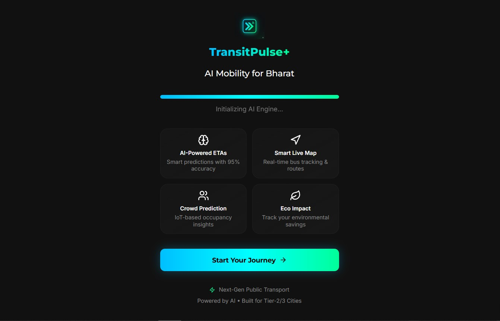
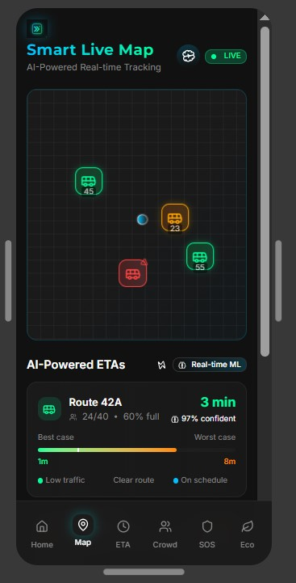
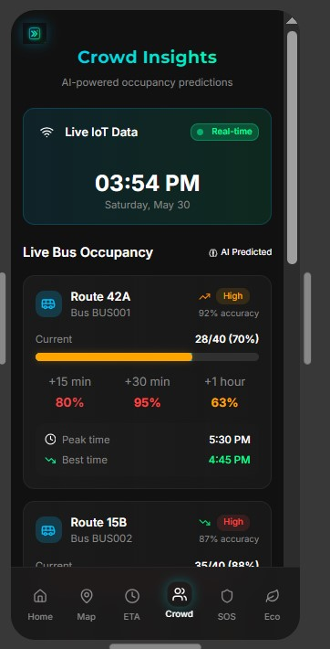

# 🚍 TransitPulse

AI-Powered Smart Public Transport Platform designed for Tier-2 and Tier-3 cities.

TransitPulse helps commuters make smarter travel decisions through real-time tracking, ETA prediction, crowd analytics, safety features and sustainability insights.

---

## ✨ Features

### 🧠 AI ETA Prediction

* Real-time arrival predictions
* Confidence scoring
* Best-case and worst-case estimates

### 🗺 Smart Live Map

* Live vehicle tracking
* Route visualization
* Fleet monitoring

### 👥 Crowd Analytics

* Occupancy prediction
* Peak-hour forecasting
* Smart route recommendations

### 🆘 Emergency SOS

* One-tap emergency alerts
* Multiple emergency categories
* Safety-focused design

### 🌱 Eco Impact Tracking

* CO₂ savings estimation
* Money saved insights
* Sustainable travel awareness

---

## 📸 Screenshots

### Home Screen

### Smart Live Map

### Crowd Analytics

---

## 🎨 Design Prototype

### Interactive Figma Prototype

https://www.figma.com/make/sYR9gYmEvP47gIAEw2Xm0c/TransitPulse-Mobile-App-Prototype?t=QYB1SaWfU4UAS4GD-0

---

## 🛠 Tech Stack

* React
* TypeScript
* Vite
* Tailwind CSS
* Figma

---

## 🎯 Vision

TransitPulse aims to modernize public transportation experiences using AI-driven insights, real-time data and user-centric design.

Built with a focus on accessibility, sustainability and smarter urban mobility.

---

## 🚀 Future Scope

* Real-time GPS integration
* Smart route optimization
* Predictive traffic analysis
* Multi-city deployment support
* AI-powered travel recommendations
* Sustainability analytics dashboard

---

## 👨‍💻 Author

### Abhishek Dwivedi

🌐 Portfolio
https://abhishekdwivedi-portfolio.vercel.app

💼 LinkedIn
https://www.linkedin.com/in/abhishekdwivedi29/

📧 Email
[abhishekdwi455@gmail.com](mailto:abhishekdwi455@gmail.com)

---

⭐ Building smarter mobility experiences through technology.
